<div align="center">

# autopilot

**An agent skill that runs autonomous work — on any project — until the goal is actually met.**

It is portable because it asks the work what «done» means instead of assuming,<br/>
and it does not stop until that answer is satisfied.

[](https://github.com/vladyslav-betterme/autopilot-skill/actions/workflows/verify.yml)
[](test/autopilot.test.mjs)
[](package.json)
[](package.json)
[](LICENSE)

```bash
npx skills add vladyslav-betterme/autopilot-skill
```

</div>

---

> [!IMPORTANT]
> **Three claims this skill exists to make impossible.**
> - «It works» — when nothing ran it.
> - «It's done» — when the only judge was the one who did it.
> - «I worked on it» — with no record of what was tried, what failed, and why.

Code, documents, data, research, infrastructure, ops: the loop below is
identical for all of them. Only the **check** differs.

## The loop

```mermaid
flowchart LR
    subgraph setup["&nbsp;once per project&nbsp;"]
        direction TB
        D["<b>discover</b> — the project's own<br/>check, homes, danger signals"]
        S["<b>arm</b> — the skills this niche needs,<br/>and the tools it can reach"]
        G["<b>goal</b> — one falsifiable sentence,<br/>criteria someone else can check"]
        D --> S --> G
    end

    subgraph iter["&nbsp;every iteration&nbsp;"]
        direction TB
        P["<b>pick</b> an unmet criterion<br/><i>does it already exist?</i>"]
        B["<b>build</b> the smallest thing<br/>that is actually correct"]
        C["<b>prove</b> — run the check,<br/>read the exit code yourself"]
        V["<b>verify</b> — a subagent that did<br/>not do the work, told to refute"]
        L["<b>land</b>, and confirm it landed"]
        R["<b>record</b> — win · failure ·<br/>decision · changelog"]
        P --> B --> C --> V --> L --> R
    end

    W{"a win seen<br/>three times?"}
    N["<b>write a new skill</b><br/>live in this session"]
    Q{"every criterion met<br/>AND verified?"}
    Z(["<b>stop</b> — and say what is left"])

    G ==> P
    R --> W
    W -- yes --> N --> Q
    W -- no --> Q
    Q -- no --> P
    Q == yes ==> Z
    K["<b>checkpoint</b> — ledger, commit,<br/>compact, resume from the ledger"]
    iter -. "80% context" .-> K
    K ==> P
    iter -. "money · irreversible · nothing moved twice" .-> Z
```



## Quick start

Run these once per project, from the project root. `<skill>` is where the skill
landed — `.agents/skills/autopilot` after the install above.

```bash
node <skill>/scripts/discover.mjs      # what «done» means here, and what is dangerous
node <skill>/scripts/bootstrap.mjs     # the ledger: goal · wins · failures · decisions · changelog
node <skill>/scripts/skills.mjs        # the skill library — then install this project's niches
node <skill>/scripts/tools.mjs         # what it can already REACH: MCP servers, plugins, and what nothing on disk knows
```

Then say «працюй автономно», «продовжуй», run `/loop`, or ask for an unattended
campaign — the skill fires on its own description.

<details>
<summary><b>What discovery answers</b> — and why an empty answer is not permission</summary>

<br/>

```jsonc
// node <skill>/scripts/discover.mjs   (abridged)
{
  "project":     { "kind": "node", "packageManager": "npm", "checks": ["npm run verify"] },
  "memoryHomes": ["CLAUDE.md", "docs/learnings", "CHANGELOG.md"],
  "signals":     { "hasCI": true, "vcs": "git", "envFilesPresent": [".env.local"], "dirty": false }
}
```

**`checks` is the definition of done for every iteration.** Node, Deno, Python,
Rust, Go, Gradle, Maven, .NET, Ruby, Elixir, `Makefile` and `justfile` targets,
plus composer scripts — and only where the tool is actually installed: a check
this machine cannot run is the invented check in another coat. What it declines
to claim for that reason comes back as `missingTools`.

An empty `checks` is a legitimate answer — normal for research, prose and ops —
but the skill does not take it at face value. It first greps the memory homes
and README for a check named in prose: one project's `checks: []` sat beside a
`CLAUDE.md` naming a script that ran 63 tests in four seconds. Only then does it
ask you to agree an acceptance check. **It never invents one.**

`bootstrap.mjs` writes the ledger into the project's *own* memory home and never
overwrites — it prints what it deliberately left alone.

</details>

## Why it is portable

A loop with no check stops when the model is satisfied. So the check is
discovered, and when there is no command, it is still not an opinion:

| The work | A check that is not your own opinion |
| --- | --- |
| **code** | a command that exits 0, run in the foreground |
| **a document** | a claim-by-claim list with a source or a command per claim |
| **data** | a query someone else can re-run that returns the expected shape |
| **infra / ops** | an observation from the system itself, before and after |
| **research** | the query that produces the number, plus the result you registered *in advance* as refuting it |

> [!WARNING]
> Three ways a check lies, all observed in the wild:
> `check | tail` reports `tail`'s status · `check > log; echo done` exits with
> `echo`'s status · a backgrounded wrapper reports the **wrapper**.
> Foreground, exit code, in the shell that ran it — or you have not proven anything.

## It arms itself, and it writes its own skills

**Before iteration one** it installs what this project's niche needs, from a
tagged shortlist of the best public skill sets:

```bash
node <skill>/scripts/skills.mjs                            # the catalogue and its tags
node <skill>/scripts/skills.mjs --install any --dry-run    # the exact commands, run nothing
node <skill>/scripts/skills.mjs --install react,perf,db    # this project's niches
```

It refuses to install everything: every skill's description costs context on
**every** turn, so a hundred skills is not a hundred capabilities — it is a
smaller window and a model that skims.

That budget is then **measured, not assumed**: `skill-cleaner` ships in the
`any` set, and the loop runs it after arming and after every skill it writes —
reporting what the installed descriptions cost, what duplicates what, and what
nothing has used. Uninstall follows from the report.

<details>
<summary><b>The eight sources it draws from</b></summary>

<br/>

| Source | What it brings | Tags |
| --- | --- | --- |
| [`obra/superpowers`](https://github.com/obra/superpowers) | Process: brainstorming, plans, systematic debugging, TDD, verification, code review | `any` `plan` `debug` `test` `review` |
| [`anthropics/skills`](https://github.com/anthropics/skills) | Official: docx · xlsx · pptx · pdf, MCP, artifacts, skill authoring | `docs` `office` `api` `design` `skills` |
| [`mattpocock/skills`](https://github.com/mattpocock/skills) | Engineering: review, domain modelling, specs, tickets, triage | `code` `plan` `product` `research` |
| [`addyosmani/web-quality-skills`](https://github.com/addyosmani/web-quality-skills) | Accessibility, Core Web Vitals, performance, SEO | `web` `perf` `a11y` `seo` |
| [`vercel-labs/openreview`](https://github.com/vercel-labs/openreview) | React, Next.js, React Native practice | `react` `next` `mobile` |
| [`supabase/agent-skills`](https://github.com/supabase/agent-skills) | Postgres and Supabase, including the security agents get wrong | `db` `sql` `backend` |
| [`steipete/agent-scripts`](https://github.com/steipete/agent-scripts) | Native, browser, GitHub, release, infra — single skills only | `mac` `swift` `infra` `browser` |
| [`vercel-labs/skills`](https://github.com/vercel-labs/skills) | The installer, and `find-skills` for a niche nothing covers | `skills` |

Outside code and web the catalogue is thin, and it says so rather than
pretending: `find-skills` is the entry point for anything it does not cover.
Everything it does install is third-party code that runs with your permissions —
`--dry-run` first, then read what you added.

</details>

**During the loop it writes new ones.** A pattern recorded in `wins.md` three
times graduates into a skill of its own — written by the loop, and **live in the
same session**, with no restart and no copy step:

```bash
node <skill>/scripts/new-skill.mjs piped-check -d "when a check reads green locally and red in CI…"
node <skill>/scripts/new-skill.mjs <name> -d "…" < body.md
```

It writes into the shared skills home and symlinks into every agent directory
the project has (`.claude`, `.codex`, `.gemini`, `.cursor`, `.opencode`),
refuses a name that already exists — including one held by a dangling symlink —
and refuses a description under 40 characters, because the description **is** the
trigger.

## Running it

Two shapes, and they are not the same thing:

```bash
node <skill>/scripts/loop.mjs --agent "claude -p 'continue the loop; read docs/goal.md first'"
node <skill>/scripts/loop.mjs --status
```

`loop.mjs` iterates **now**, in front of you. What makes it a loop rather than a
`while true` is that it stops on the ledger's terms: a `STOP` file, a signal,
`--max` iterations (25 by default, never «forever»), **thrash** — two
iterations with no commit and no ledger-content change — an agent that exits
non-zero twice running, or one that returns in under a second five times. Each stop is written to `agent-logs/loop.jsonl` with its reason, and it
refuses to start without a `goal.md` at all.

`<ledger home>/STEERING.md` is read fresh every iteration and handed to the
agent on stdin: reprioritise mid-flight without killing the run. `STOP` is the
switch, steering is the dial.

`carrier.mjs` is the other shape — a launchd or GitHub unit that outlives the
session. It prints; it installs nothing.

## Reach, not only knowledge

Skills change what the agent knows; they do not let it touch anything new.
`tools.mjs` inventories what this machine can already reach — MCP servers across
Claude Code, Cursor, VS Code, Gemini, opencode and Codex, plus plugins — and is
explicit about what no config file can answer: connectors live in an account,
a configured server that fails to launch reads exactly like «no such tool», and
only a running session knows which tools a server exposes.

When something has no server, the loop climbs a ladder instead of narrowing the
goal: **already reachable → the app's own CLI → a public server → write one.**
Rung two is the one that gets skipped and is usually right — After Effects has
`aerender`, macOS has `osascript`, and a shell command needs no server at all.

```bash
node <skill>/scripts/new-mcp.mjs after-effects -d "drives AE through aerender — no public server covers it"
```

It scaffolds a zero-dependency stdio server, registers it, and — the part that
matters for an unattended run — exposes the **same handlers as a CLI**:

```bash
node tools/after-effects-mcp/server.mjs --call ping '{"text":"hello"}'
```

A harness reads its MCP config at **startup**, so a server written mid-run is
invisible to the session that wrote it. Without that CLI path, «I built the
tool, continue after a restart» is a loop that stalled while producing a file.

## What's inside

| File | What it carries |
| --- | --- |
| [`SKILL.md`](skills/autopilot/SKILL.md) | The loop: the goal, the iteration, the check, the verification, the ledger, distillation, when to stop and ask, when to stop the loop. |
| [`references/premise-check.md`](skills/autopilot/references/premise-check.md) | Check whether the thing already exists before building it. The highest-yield habit here — «two answers to one question» was 35 % of all defects in one campaign, and the only cause whose share *grew*. |
| [`references/critics.md`](skills/autopilot/references/critics.md) | The review shape that produced reproductions instead of essays: one lens per hunter, one skeptic per finding, everyone read-only. |
| [`references/ledger.md`](skills/autopilot/references/ledger.md) | The five files, and the admission bar that keeps each one worth reading. |
| [`references/distillation.md`](skills/autopilot/references/distillation.md) | Turning a pattern that worked **three times** into a skill — and when to delete one. |
| [`scripts/discover.mjs`](skills/autopilot/scripts/discover.mjs) | The project's own check, its memory homes, and the signals a loop must not trip — including whether version control exists at all. |
| [`scripts/bootstrap.mjs`](skills/autopilot/scripts/bootstrap.mjs) | The ledger, in the project's **own** memory home, only what is missing. |
| [`scripts/skills.mjs`](skills/autopilot/scripts/skills.mjs) | The skill library, tagged by niche. Installs on request, never wholesale. |
| [`scripts/new-skill.mjs`](skills/autopilot/scripts/new-skill.mjs) | Write a skill from a win and link it where the harness actually loads from. |
| [`references/tooling.md`](skills/autopilot/references/tooling.md) | The capability ladder — already reachable, the app's own CLI, a public server, then write one. Plus what a tool result is (untrusted input) and what a server costs (context, every turn). |
| [`scripts/tools.mjs`](skills/autopilot/scripts/tools.mjs) | MCP servers and plugins across seven config surfaces — and the honest list of what nothing on disk can tell you. |
| [`scripts/new-mcp.mjs`](skills/autopilot/scripts/new-mcp.mjs) | Write the server that does not exist, register it, and call it **now** — an MCP config is usually only read at startup. |
| [`scripts/prove.mjs`](skills/autopilot/scripts/prove.mjs) | Run the check and BE the thing that reports its status — no shell, a piped npm script refused, flaky detected, the number written into `goal.md` by the run rather than by the summary. |
| [`scripts/carrier.mjs`](skills/autopilot/scripts/carrier.mjs) | Emit the launchd or GitHub Actions unit that outlives the session — and install nothing. cron was cut: four findings in three rounds, all in a grammar nothing in the check could execute. |
| [`scripts/loop.mjs`](skills/autopilot/scripts/loop.mjs) | The loop as a **process**: iterate until a `STOP` file, `--max`, thrash (no commit and no ledger change), or an agent that keeps failing. `STEERING.md` is read fresh each pass. `--status` shows what the runs did. |
| [`scripts/lib.mjs`](skills/autopilot/scripts/lib.mjs) | The questions two scripts both ask, asked in one place. |

## The parts worth stealing even if you never install it

- **The check is discovered, not declared** — and run once *before* the first
  iteration too. A failure that predates you is a decision to record, not your
  fault to inherit.
- **Every new guard needs a demonstration you have watched fail.** Delete the
  fix, run it, see red, restore. A guard that cannot fire is worse than none: it
  reads as proof the case is handled.
- **Verification is not self-service.** At least one subagent that did not do the
  work, read-only, told to refute — self-inflicted defects were 58–68 % of all
  findings in the later rounds of one measured campaign.
- **Never a second home for one kind of knowledge.** A second `CHANGELOG.md` is
  worse than none, because now neither is authoritative. The rule survives a
  rename: a project keeping `defect-patterns.md` never gets a `failures.md`.
- **Autonomy is not permission.** Money, anything irreversible, and reversing a
  written directive all stop and ask. *Blanket approval is permission, not
  information.*
- **Asking must not kill an unattended run.** A criterion blocked on a human
  decision is parked with both options and their costs; the loop moves on and
  stops when everything left is parked.
- **Stop on a criterion, not on a mood** — and on **thrash**: two iterations with
  nothing advanced is a wrong premise, not persistence.
- **A stopping rule nothing can satisfy is not a stopping rule.** «No fatal in
  the same area two rounds running» was lost four times out of four here. What
  replaced it is about artifacts: a differential oracle per guard, every emitted
  grammar executed by its real interpreter, and two rounds adding zero new
  CAUSES. If you cannot run an emitted grammar in your check, cut it.
- **A full context is a checkpoint, not a stop.** Write the state into the
  ledger, commit what is green, compact, and resume by re-reading the ledger —
  never from the summary written by the context being discarded. Safe only
  because a cold-start drill proves the ledger carries the campaign; run it
  first, or compaction will lose work.

## Tests

```bash
npm test          # no install step, no dependencies — the count is in the output, not in this line
```

They are not decoration. Most of them pin defects a five-lens review council
reproduced in these very scripts.

<details>
<summary><b>What the council found</b> — and what it cost</summary>

<br/>

| Was | Now pinned by |
| --- | --- |
| `--install` built one comma-joined `-s`, so the arming step installed **nothing** | an argv assertion that needs no network |
| The ledger was written *beside* a project's real one, because two scripts kept two lists of where knowledge lives | one list in `lib.mjs`, one scanner, one test across both scripts |
| A `package.json` silenced the `Makefile` check the project actually had | every detector runs, checks are unioned |
| `check:=1` — a make **variable** — produced a `make check` that exits 2 | a target must be a target |
| A written skill reached one agent directory out of two | linking from whichever home was elected |
| `dirty: false` meant both «clean tree» and «no version control at all» | `signals.vcs` |

And one about the tests themselves: the guard against overwriting a file **had no
test that could fail** — the whole suite stayed green with `flag: 'wx'` deleted.
It now goes red.

> A guard with no failing demonstration is decoration.

</details>

## Limits

- It is a **skill, not a harness**: it describes the loop, the critic prompts,
  the ledger and the stopping rule. Your agent tooling dispatches the subagents
  and runs the checks.
- Check discovery covers the ecosystems listed above. Anything else reports **no
  check** — deliberately, and loudly.
- `bootstrap.mjs` looks for existing ledger files in `.`, `docs/`, `notes/` and
  `.github/`, one level below each. A ledger buried deeper is not seen; read the
  `left alone` line before accepting what it created.
- `skills.mjs` shells out to `npx skills` for installs, so that one command needs
  the network. Everything else is offline.
- `tools.mjs` reads config **files**. It cannot see connectors, cannot tell you
  whether a server starts, and does not know which tools one exposes — it says so
  in its own output rather than implying coverage it does not have.
- `new-mcp.mjs` registers into JSON config (`.mcp.json`, `.cursor/mcp.json`) and
  **refuses** a TOML path rather than overwriting a Codex config; add that block
  by hand. The scaffold is hand-rolled JSON-RPC on purpose — right for a handful
  of tools, wrong for forty, where `mcp-builder` and the official SDK take over.
- Zero dependencies, plain Node ≥ 20.11 — except that `new-skill.mjs` links with
  symlinks, which on Windows need Developer Mode or an elevated shell.

<div align="center">
<br/>

**MIT** — see [LICENSE](LICENSE). Written to be stolen from.

</div>
